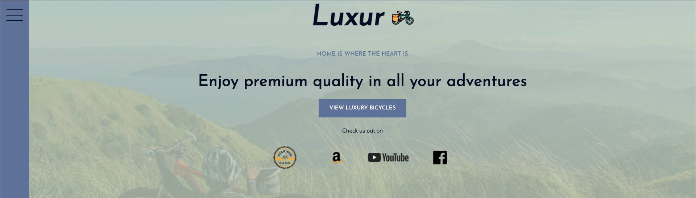
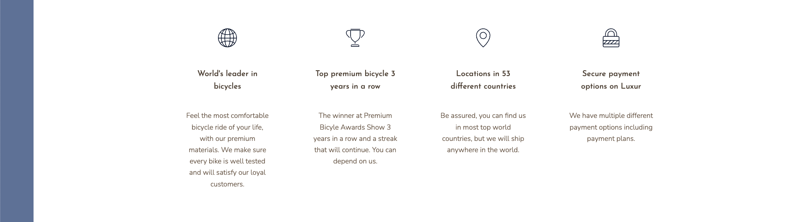
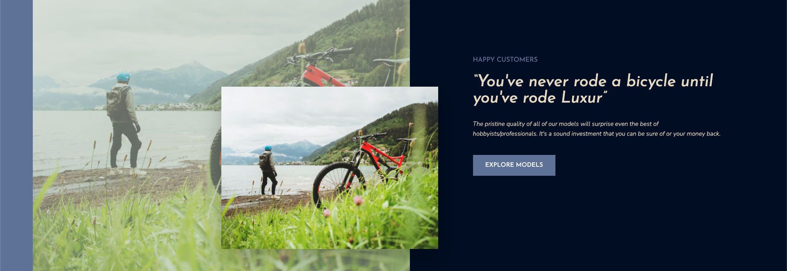
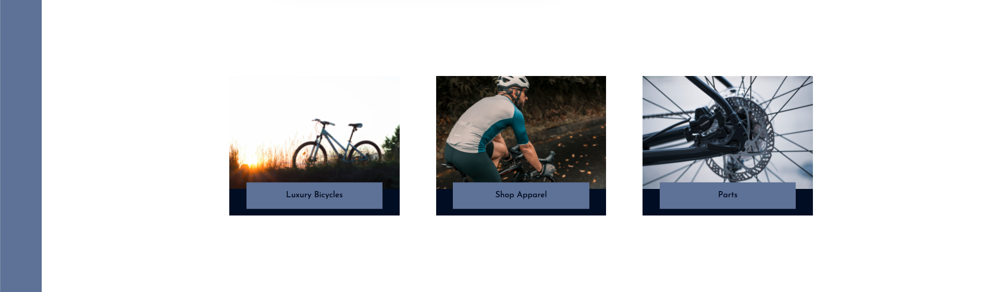
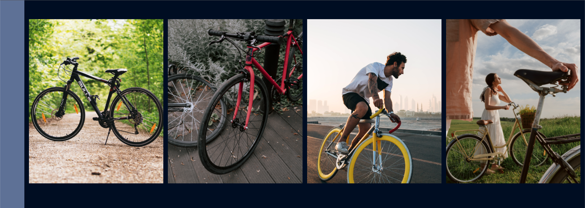
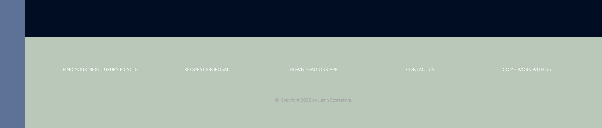

# Luxur - A Website for Luxury Bicycles

I had discovered CSS grid and wanted to work on a bigger project based on it. So now we have Luxur, a website for those who those who prefer a premium ride

**Link to project: [Github]https://github.com/Jscorz/LuxurBikes**

<!-- 
 -->

---

## **How It's Made:**

---

**Tech used:** HTML, CSS, SASS

I began building out the markup of the page making the design elements similar to other websites I enjoyed the design of. I decided how many sections of the site I would need and laid out a starter template for the grid container and applied it so. Then i started building out more grid layouts within each section starting with the header. I used various svg's for the icons and images from free-hosting sites. I used grid to rest another image across an already-existing image as it's made easier with CSS grid. I will add some Javascript functionality to the website at a later date.

## **Lesson's learned:**

---

The main takeaway I had for this project was definitely layout-based. I got much more comfortable with the way that CSS grid and its properties work. I also learned to layover an image over an image without having to use absolute positioning.

## **Optimizations:**

---

Not much has been optimized past getting the layout extremely responsive. I will add Javascript functionality to it later.
